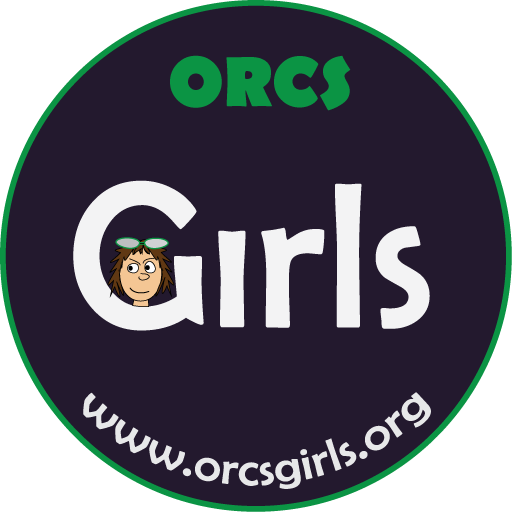

# Python Notebooks ORCSGirls classes

Welcome to out collection of iPython notebooks developed by [ORCSGirls](http://www.orcsgirls.org) for their coding and technology classes for Middle School girls. Details of the classes and related materials are available [here](http://www.orcsgirls.org/links).

Current classes are

* `IntroPython` - Activities for *Python using Jupyter Notebooks*.
* `Algorithms` - Activities for *Fun with Algorithms*.
* `ArtisticMath` - Activities for *Artistic Math*.
* `Binary` - Activities for *Magic of Binary*
* `DoodleMining` - Activities for *Doodles Data Mining*.
* `Fractals` - Activities for *Beauty of Fractals*.
* `MachineLearning` - Activities for *Artificial Intelligence: How Computers Learn*.
* `TextMining` - Activities for *Text Mining*.

Contact: [thomas@orcsgirls.org](mailto:thomas@orcsgirls.org)

